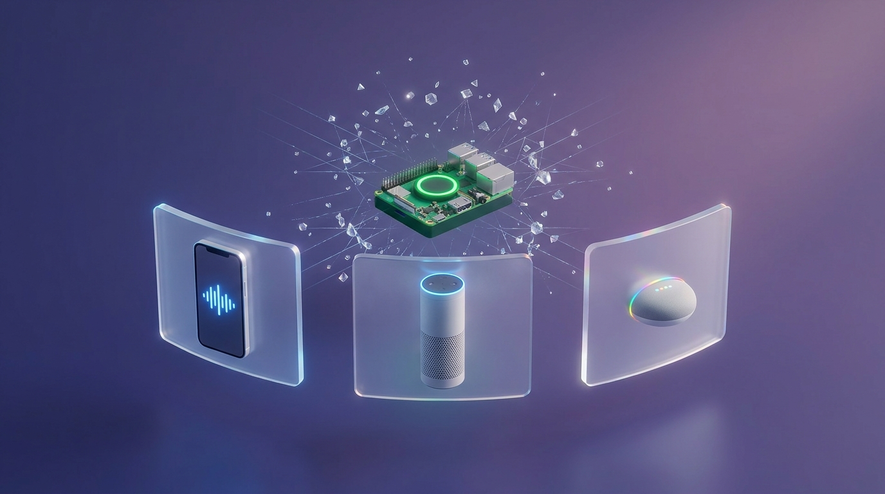
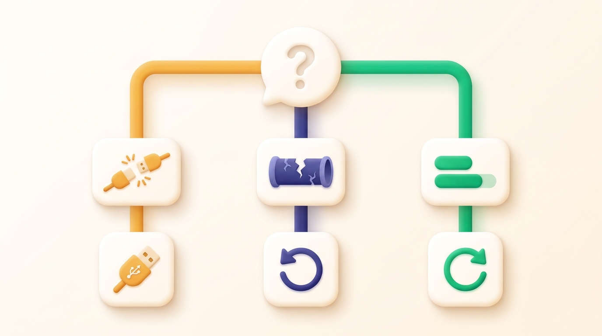
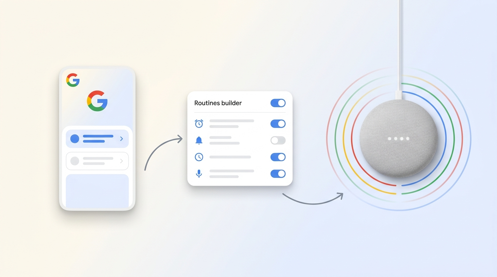

# Cognitum Learn



**Your Cognitum One Seed becomes a genius on what you care about — buildable on your Mac, chattable on your computer, voice-accessible everywhere in your home.**

This is not just a knowledge-base tool. It is three things that work together:

- **Build** — your Mac downloads videos, transcribes audio, and pushes a searchable expert to your Seed.
- **Chat** — talk to your knowledge base from your computer, via the command line or a local web dashboard.
- **Voice** — ask Siri, Alexa, or Google a question and hear the answer spoken back. Anywhere in your home.

No cloud account. No subscription. Your knowledge lives on your Seed, on your network.

---

## Quickstart — five steps from zero to "Hey Siri, ask Cognitum"

```bash
# 1. Install on your Mac (prebuilt binary, no developer tools required)
T=$(mktemp -d) && curl -L https://github.com/stuinfla/cognitum-learn/releases/latest/download/learn-aarch64-apple-darwin.tar.gz | tar xz -C "$T" && "$T/learn-aarch64-apple-darwin/install.sh"
brew install yt-dlp ffmpeg

# 2. Bind your Seed (one time)
learn config set seed.address cognitum-9842.local
learn config set seed.auto_push true
learn doctor

# 3. Build a knowledge base
learn study "sous vide cooking for beginners"

# 4. Chat with it from your Mac
learn chat sous-vide
# OR open the web dashboard
learn ui

# 5. Set up voice (v0.6.0 wizard — see "Voice setup" below)
learn voice setup     # opens a browser wizard, walks you through Apple + Alexa + Google
```

After step 5, *"Hey Siri, ask Cognitum what temperature for medium-rare steak"* speaks the answer back to you from any iPhone, HomePod, Echo, or (with limits) Google Nest in your home.

> Your knowledge base is one file: `~/Docs/KB/sous-vide.rvf`. The Seed gets an identical copy at `/var/lib/cognitum/rvf-store/`. You own both.
>
> **Don't have Apple Silicon?** Linux x86_64, Linux aarch64, and Windows x86_64 binaries are on the [latest release page](https://github.com/stuinfla/cognitum-learn/releases/latest).

---

## Three modes of use

Mac builds. Seed hosts. Voice anywhere.

<!-- DIAGRAM_REGEN: assets/voice-setup/wizard-hero.png — refresh when ecosystem layout changes. -->

```
   MAC (the workshop)              COGNITUM SEED (the house)           YOUR HOME (the voice)
   ─────────────────────           ───────────────────────────         ────────────────────────
   learn ingest <url>      ──►     /var/lib/cognitum/rvf-store/    ◄── "Hey Siri, ask Cognitum…"
   learn study "topic"             single file per topic               "Alexa, ask Cognitum…"
   learn chat <topic>              answers questions locally           "Hey Google, run Cognitum check"
   learn ui (dashboard)            with cited timestamps
```

<!-- DIAGRAM_REGEN: assets/three-modes-flow.svg — render the ASCII above. -->

### 1. Build (on your Mac)

The Mac does the heavy work — once per topic. It finds videos, downloads them, runs them through Whisper or VTT captions, chunks the transcript, embeds each chunk with BGE-small-en-v1.5 (384-dim), and writes everything into a single `.rvf` file. If `seed.auto_push: true`, the file is pushed to your Seed automatically when the ingest completes.

```bash
learn study "Japanese knife sharpening"           # autonomous discovery + ingest
learn ingest "https://youtu.be/QZMljuD10sU"        # one video
learn import ~/Downloads/lectures/                 # local files (PDF, MP3, MP4, TXT, MD)
```

### 2. Chat (on your Mac)

Once a KB is built, you can talk to it from your computer two ways: CLI or browser.



```bash
learn ask   knife-sharpening "what angle for a 210mm gyuto?"
learn apply knife-sharpening "give me a 20-minute sharpening routine for 3 knives"
learn chat  knife-sharpening                       # multi-turn dialog, session-persistent
learn ui                                           # opens http://127.0.0.1:7878 in your browser
```

`learn ui` is the friendliest entry — a self-contained React dashboard served by the built-in Axum bridge. Pick a topic, watch ingest progress live, chat with the KB, no terminal required.

### 3. Voice (anywhere in your home)

This is the new piece in v0.5.7+. After running the voice setup, you can ask your KB questions out loud and hear the cited answer spoken back. Three ecosystems, same KB:

| Ecosystem | What you say | What you hear back |
|---|---|---|
| **Apple** (iPhone, HomePod, CarPlay) | *"Hey Siri, ask Cognitum what temperature for medium-rare steak"* | *"54 degrees Celsius for 1 to 4 hours gives perfect medium-rare edge to edge."* |
| **Alexa** (Echo Dot, Echo Show) | *"Alexa, ask Cognitum about laminating dough"* | *"Lamination creates layers of fat between dough sheets, producing flaky pastry."* |
| **Google** (Nest Mini, Nest Hub) | *"Hey Google, run Cognitum check"* | A pre-defined voice Routine fires; speaker broadcasts the answer summary. Arbitrary slot Q&A on Nest hardware is not possible — Google retired that surface in 2023. See [voice setup](#voice-setup) for the three Routine patterns. |

The voice surface is the same KB you built on your Mac. No second copy, no re-indexing.

---

## What can you ask?

Whatever you trained the KB on. A few real examples from Stuart's home:

**At the CLI:**

```bash
learn ask sous-vide "what temperature for a medium-rare steak?"
# → 54°C for 1–4 hours [Sous Vide Everything @ 3:12]

learn ask family-recipes "how long does Nonna's tomato sauce simmer?"
# → 3 hours covered, then 1 hour uncovered [grandma-cookbook.pdf p.14]

learn ask type-2-diabetes "is intermittent fasting safe with metformin?"
# → Generally yes if monitored; consult MD. [Dr. Berg @ 12:04, Mayo Clinic @ 4:33]
```

**In the dashboard chat (no terminal):**

> *"Walk me through a croissant lamination schedule for tomorrow morning. My kitchen is 68°F."*
>
> The dashboard hands the question to the KB, picks the best 10 chunks, and gives you a grounded answer with every step linked to the exact video moment that taught it.

**Out loud, anywhere in your home:**

> *"Hey Siri, ask Cognitum what knife angle for a gyuto."*
>
> *"Alexa, ask Cognitum about beurrage temperature."*
>
> *"Hey Google, is the room safe?"* (Google Routine — uses presence sensors + KB context.)

---

## Voice setup

**Manual setup (v0.5.7 / v0.5.8 — current):** voice access today is a CLI procedure. The full step-by-step is in [`docs/voice-setup-manual.md`](docs/voice-setup-manual.md) — Apple Shortcut install, Alexa Custom Skill publish, Google Routines, plus a `voice-proxy` LaunchAgent on your Mac. About 30 minutes if you've done it once, longer first time.

**Wizard (v0.6.0 — designed, implementation in Phase 2.0):** a single command will replace the 30+ manual steps with an interactive browser wizard.

```bash
learn voice setup                # opens http://127.0.0.1:7878/voice-setup
learn voice setup --ecosystem apple    # one ecosystem at a time
```

The wizard does the work *and* shows you what's happening — embedded OAuth callbacks (no paste-this-code-back-into-the-terminal), live progress over SSE, dynamic QR codes for iPhone hand-off, and pre-recorded GIFs for the Alexa app and Google Home app screens. Architecture is in [`ADR-CL-004`](https://github.com/stuinfla/cognitum-home-integration/blob/main/docs/ADR-CL-004-visual-voice-setup-wizard.md); the seven UI assets already exist in `assets/voice-setup/`. Implementation lands across cognitum-learn v0.6.0a → v0.6.0d.

### The three ecosystems at a glance


**Apple** (≤4 min). A Shortcut on your iPhone calls your Mac's voice-proxy over HTTPS via a cloudflared tunnel; the proxy calls `learn ask` and returns the cited answer for Siri to speak. Works on iPhone, HomePod, CarPlay, Apple Watch. Free, LAN-friendly, no developer account needed. **GA in v0.5.7.**


**Alexa** (≤5 min). A private Custom Skill on your Amazon developer account proxies *"Alexa, ask Cognitum about X"* to a Lambda function, which calls your Mac's voice-proxy via the same tunnel. Free under AWS free tier (1M requests/month). **In flight tonight** — the Haiku-fast-path Lambda handler is being isolated in a separate codepath so the slow-path full-Sonnet retrieval doesn't time out Alexa's 8-second response window.



**Google** (≤6 min, optional). Three pre-defined Routines in the Google Home app: *"Hey Google, run Cognitum check"*, *"is the room safe"*, *"good morning Cognitum"*. Each fires a script in Home Assistant that broadcasts a TTS answer back through `notify.google_assistant_sdk`. Sensor fanout (presence, room state) works first-class; **arbitrary-slot Q&A on Nest hardware is not possible** — Google sunset Conversational Actions on June 13, 2023 with no replacement. Use Siri or Alexa for free-form questions.

### What the wizard automates (v0.6.0)


| Phase 1.1 manual step | v0.6.0 wizard behaviour |
|---|---|
| Confirm Seed reachable via `lsof` + mDNS probe | Pre-flight handler hits `GET /api/v1/identity`; UI shows green check |
| `ask configure` (Alexa CLI auth) | Embedded OAuth via cloudflared callback — token captured automatically |
| Mint a Seed bearer via USB pair window | Probed first; if cached bearer valid, step skipped silently |
| Edit Shortcut `.wflow` template by hand | Rendered server-side with your voice-proxy URL pre-filled, served via iCloud QR |
| `cloudflared tunnel run` in a separate terminal | Orchestrator spawns + supervises tunnel for the wizard's lifetime |
| Pick a KB to expose | Wizard enumerates `~/Docs/KB/*.rvf`, checkboxes, push runs with SSE progress |

---

## Privacy and ownership

- **Your knowledge lives on your hardware.** The `.rvf` file is on your Mac at `~/Docs/KB/<topic>.rvf` and on your Seed at `/var/lib/cognitum/rvf-store/`. Copy it, back it up, delete it — you control it.
- **Your audio never leaves your machine.** Whisper and BGE run on-device. The only outbound network call is `learn ask`'s text completion to Anthropic, and you can replace that with on-device RuVLLM by setting `LEARN_SYNTH_LOCAL=1`.
- **The voice path stays on your LAN.** Siri, Alexa, and Google all hit your Mac's voice-proxy through a cloudflared tunnel — your KB is never uploaded to Apple, Amazon, or Google. The tunnel only carries one HTTPS round-trip per spoken question.
- **No telemetry.** Cognitum Learn does not phone home. Ever.

---

## How it works (collapsed)

<details>
<summary><strong>The Mac–Seed–voice split</strong></summary>

Cognitum Learn is a three-tier system. Each tier has one job.

```
  YOUR MAC (the workshop)              YOUR SEED (the house)               YOUR HOME (the voice)
  ─────────────────────────            ─────────────────────────           ───────────────────────────
  Find videos, download them,          Hold the KB. Answer questions       Siri / Alexa / Google sends
  transcribe audio, chunk text,        with the same retrieval +           the spoken question to your
  embed with BGE-small (384-dim),      synthesis pipeline. Native          Mac's voice-proxy via a
  build .rvf, push to Seed.            RVF; no conversion needed.          cloudflared tunnel. The proxy
                                                                            calls `learn ask`, returns text,
                                                                            the assistant speaks it.

  Hardware: M-series Mac               Hardware: Pi Zero 2W                Hardware: iPhone / Echo / Nest
  Software: learn CLI + Whisper        Software: cognitum-agent +          Software: voice-proxy on Mac +
  Storage: ~/Docs/KB/*.rvf             rvf-store + 114-tool MCP proxy      ecosystem skill / shortcut
```

<!-- DIAGRAM_REGEN: assets/three-tier-flow.svg — render the ASCII above. -->

**Why this split:** the heavy one-time work (ingest) needs CPU and the internet. The everyday work (answer questions) needs to be on the Seed where the knowledge actually lives. The voice surface needs to be wherever the user is — kitchen, car, bedroom — and so rides through the cloud-borne assistants that already have microphones in those places. Each tier does what its hardware is good at.

The three-ecosystem architecture is documented in [ADR-CL-003](https://github.com/stuinfla/cognitum-home-integration/blob/main/docs/ADR-CL-003-three-ecosystem-connectivity.md). Sensor fanout (the 21 RuView entities — presence, temperature, etc.) rides the same path through Home Assistant; voice Q&A is the simpler lane that bypasses HA entirely.

</details>

<details>
<summary><strong>Ingest pipeline</strong></summary>


```
Source URL or path
      ↓
  ACQUIRE — yt-dlp pulls captions first; falls back to audio
      ↓
  SMART FRAME DECISION — pHash variance decides whether to extract
  visual frames (demos) or skip (talking heads)
      ↓
  TRANSCRIBE — VTT captions where available, else Whisper.cpp on-device
      ↓
  CHUNK — sentence-aware, ~300 tokens, 50-token overlap
      ↓
  EMBED — BGE-small-en-v1.5 (384 dimensions, ONNX, on-device)
      ↓
  INDEX — append-only HNSW segments inside the .rvf file,
  with an Ed25519 witness chain per chunk for tamper evidence
      ↓
  AUTO-SUMMARY — Claude generates 3-5 key takeaways
      ↓
  ~/Docs/KB/<topic>.rvf       ←auto-push→     /var/lib/cognitum/rvf-store/<topic>.rvf
```

<!-- DIAGRAM_REGEN: assets/diagrams/ingest-pipeline.svg — keep current asset. -->

</details>

<details>
<summary><strong>Query path (for both Mac chat and voice)</strong></summary>


```
Question (typed or spoken)
      ↓
  EXPAND — HyDE generates a hypothetical answer as a second query vector
      ↓
  HYBRID RETRIEVE — dense (BGE) + BM25, fused with reciprocal rank fusion → top 50
      ↓
  RERANK — cross-encoder picks the top 10
      ↓
  MMR + SOURCE-CAP — diversity λ=0.7, no more than 3 chunks from any single video
      ↓
  SYNTHESIZE — cited prompt; abstain if signal is weak; AIMDS scan in and out
      ↓
  Cited answer with [Title @ MM:SS](url&t=Xs) links (or spoken summary for voice)
```

<!-- DIAGRAM_REGEN: assets/diagrams/query-path.svg — keep current asset. -->

</details>

<details>
<summary><strong>Storage layout</strong></summary>

```
~/Docs/KB/                          ← on your Mac
├── sous-vide.rvf                   ← chunks, embeddings, HNSW, witness chain
├── french-cooking.rvf
├── sous-vide.summary.md            ← auto-generated takeaways
├── _graph/sous-vide.graphdb        ← claims, entities, relations
├── _meta/sous-vide.json            ← per-video state
└── _chat/sous-vide/                ← session JSONL files

/var/lib/cognitum/rvf-store/        ← on your Seed (after push)
└── <topic>.rvf

~/.cognitum-learn/                  ← Mac-side state
├── voice-setup-state.json          ← (v0.6.0) wizard resume state
└── voice-proxy.token               ← (v0.5.7+) bearer for voice surface
```

</details>

<details>
<summary><strong>Architecture: 17 crates, one binary</strong></summary>

| Layer | Crate | Responsibility |
|---|---|---|
| CLI | `learn-cli` | 26 subcommands, routing, voice setup entry point |
| Ingestion | `learn-acquire`, `learn-asr`, `learn-frames`, `learn-chunk`, `learn-embed`, `learn-index`, `learn-graph` | URL → `.rvf` pipeline |
| Retrieval | `learn-retrieve` | Hybrid BM25+dense, rerank, MMR |
| Synthesis | `learn-synth` | Cited answers, in-tree AIMDS scanner |
| Chat | `learn-chat` | Multi-turn REPL, JSONL sessions |
| Serve | `learn-serve` | Axum HTTP + MCP server + (v0.6.0) voice-setup wizard |
| Voice (v0.5.7+) | `learn-voice-proxy` (separate scaffolding) | HTTPS endpoint for Apple/Alexa/Google to hit |
| Contracts | `learn-core` | Shared types, errors, topic slug |

</details>

---

## Troubleshooting

### Mac and Seed

**"My Seed isn't reachable" / `learn doctor` red on `seed.reachable`.** Confirm the address with `ping cognitum-9842.local` or use the raw IP printed on the Seed. Some routers drop `.local` names; fall back to `learn config set seed.address 192.168.x.x`. Mac and Seed must be on the same LAN. The auth token, if your Seed requires one, lives at `~/.config/cognitum/seed.token` and is read automatically.

**"Dimension mismatch" when pushing to the Seed.** Cognitum Learn embeds at 384 dims (BGE-small). A fresh Seed often shows `dimension: 8` because its sensor pipeline wrote first. The Seed is *not* hardware-limited to any particular dimension — fix it by editing the agent's `--dimension` flag and wiping the old store. Full procedure in [`docs/voice-setup-manual.md`](docs/voice-setup-manual.md) under "Dimension fix." Never chase this as a firmware bug.

**"I built a KB with an older version and now `learn ask` returns nothing."** Versions before v0.2.17 used a 1024-dim embedder; new 384-dim query vectors won't match. Re-ingest: `learn ingest <url> --topic <topic>`. `learn compact` does *not* re-embed.

### Voice setup

**Apple Shortcut won't trigger.** The Shortcut needs your voice-proxy URL embedded at install time. If you renamed the proxy or changed the cloudflared tunnel, re-install the Shortcut. The v0.6.0 wizard's troubleshooting screen (above) detects this automatically and offers a re-install QR.

**Alexa skill returns "Cognitum is having trouble."** Almost always a Lambda cold-start or timeout. The v0.5.8 release adds the Haiku-fast-path that returns within Alexa's 8-second window for short queries; long queries still fall back to a "let me think about that for a moment" response. Watch the Lambda logs (`aws logs tail /aws/lambda/ask-cognitum --follow`) for the actual error.

**Google Routine fires but speaker stays silent.** The TTS broadcast hop (`notify.google_assistant_sdk`) needs your `homegraph` service account credentials at `~/.homeassistant/google_service_account.json`. If the file is missing, only the scene fires — there's no spoken response. Re-run the Google branch of the wizard, or drop the JSON manually per [`scaffolding/voice-proxy/google/service-account-setup.md`](https://github.com/stuinfla/cognitum-home-integration/blob/main/scaffolding/voice-proxy/google/service-account-setup.md).

**cloudflared tunnel URL changes every reboot.** Quick tunnels (free) get a new `*.trycloudflare.com` on each invocation. Amazon won't accept that — its OAuth redirect URI is fixed per skill. Fix: either keep the tunnel up (the v0.6.0 wizard supervises it via launchd), or migrate to a Cloudflare account with a named tunnel (free, requires domain ownership).

### Models and dependencies

**Whisper or BGE didn't download.** Models auto-fetch into `~/.cache/learn-rs/models/`. If that failed, `learn doctor` shows which are missing; delete the cache and re-run to force a refresh.

---

## Honest current state (v0.5.8, 2026-05-26)

This README reflects what is shipped tonight and what is queued. Cognitum Learn is moving fast and we'd rather tell you what's real than make promises.

| Surface | State | Notes |
|---|---|---|
| **Build** (`learn ingest` / `learn study`) | **GA, v0.5.4+** | Apple Silicon binary primary; Linux x86_64 + Linux aarch64 + Windows x86_64 binaries published every tag. |
| **Mac chat** (`learn chat` + `learn ui`) | **GA, v0.2.11+** | React dashboard at `http://127.0.0.1:7878`; 4-step onboarding wizard for new Seed owners. |
| **Apple voice** (`Hey Siri, ask Cognitum`) | **GA, v0.5.7+** | Voice-proxy LaunchAgent + Shortcut + cloudflared tunnel; verified end-to-end on Stuart's stack. |
| **Alexa voice** (`Alexa, ask Cognitum`) | **In flight tonight** | Haiku-fast-path Lambda being isolated in v0.5.8 to fit Alexa's 8-second window; full GA expected v0.5.9. |
| **Google voice** (Routines only) | **Scripted-only** | Three pre-defined Routines work today; arbitrary-slot Q&A on Nest hardware is *not possible* (ecosystem constraint — Google retired Conversational Actions in 2023). |
| **v0.6.0 wizard** (`learn voice setup`) | **Scoped + designed** | [ADR-CL-004](https://github.com/stuinfla/cognitum-home-integration/blob/main/docs/ADR-CL-004-visual-voice-setup-wizard.md) ratified; 7 visual assets generated; implementation lands across Phase 2.0a → 2.0d (5–7 days). Until then, voice setup is manual. |
| **Linux ARM64 + Intel Mac voice setup** | **Mac-only today** | The voice-proxy assumes a Mac LaunchAgent. Pi Zero / Linux desktop hosting is on the roadmap, not shipped. |

---

<details>
<summary><strong>📦 All 26 commands</strong></summary>

### Discovery + ingestion

- **`learn study "<topic>"`** — strategic: describe what you want to learn, Cognitum Learn finds candidates, ingests on confirmation.
- **`learn ingest <url>`** — tactical: paste a URL, playlist, channel, or search query.
- **`learn import <dir>`** — bulk ingest a local folder (PDF, MP4, MP3, TXT, MD).

### Consumption

- **`learn ask`** — cited answer grounded in the KB.
- **`learn apply`** — uses the KB as prior to produce a grounded artifact.
- **`learn chat`** — multi-turn dialog with session persistence.
- **`learn quiz`** — generates practice questions from the KB.

### Inspection + visualization

```bash
learn status   <topic>       # chunk count, file size, coherence KPI
learn list     <topic>       # videos in the topic
learn who-said <topic> "Julia Child"
learn timeline <topic> "beurrage"
learn compare  <topic-a> <topic-b>
learn cloud    <topic>       # SVG word cloud
learn map                    # 2D galaxy of all your topics
learn summarize <topic>      # key takeaways
```

### Distribution + maintenance

```bash
learn push    <topic>        # push KB to your Cognitum One Seed
learn serve   <topic>        # MCP server for Claude Code
learn ui                     # local web dashboard
learn voice setup            # (v0.6.0) interactive voice-wiring wizard
learn watch   <topic>        # monitor a YouTube channel
learn eval    <topic>        # regression Q&A
learn forget  <topic> <video-id>
learn compact <topic>        # dedupe + optimize the index
learn doctor                 # health check
```

### Setup + configuration

```bash
learn setup                                  # guided first-run wizard
learn config set seed.address 192.168.1.42
learn config set seed.auto_push true
learn config get seed
```

</details>

<details>
<summary><strong>⚙️ Configuration</strong></summary>

| Variable | Purpose | Default |
|---|---|---|
| `ANTHROPIC_API_KEY` | Required for `learn ask` / `learn apply` / `learn chat` synthesis | unset |
| `LEARN_SYNTH_LOCAL` | `1` → use local RuVLLM instead of Anthropic. Fully on-device. | `0` |
| `LEARN_AIMDS_REQUIRED` | `1` → fail closed on any `Blocked` AIMDS verdict | `0` |
| `LEARN_KB_ROOT` | Where `.rvf` files live | `~/Docs/KB` |
| `LEARN_MODEL_CACHE` | Where Whisper + BGE models cache | `~/.cache/learn-rs/models` |
| `RUST_LOG` | Tracing filter (`info`, `debug`, `learn_synth=trace`) | `warn` |

**Seed config** is persisted via `learn config set seed.*`. Relevant keys: `seed.address`, `seed.token`, `seed.auto_push`.

</details>

<details>
<summary><strong>🖥️ Platform support</strong></summary>

| Platform | Prebuilt binary? | Voice setup? | Notes |
|---|---|---|---|
| M-series Mac | yes | yes (Mac is the canonical voice-proxy host) | Primary platform |
| Linux x86_64 | yes | manual only | Captions-only ingest (no on-device Whisper on Linux) |
| Linux aarch64 (Pi 5, Jetson) | yes | manual only | Captions-only |
| Windows x86_64 | yes | manual only | No on-device speech recognition |
| Intel Mac | build from source | manual only | macOS-13 GitHub runner deprecated |

</details>

<details>
<summary><strong>🧪 Testing</strong></summary>

```bash
cargo fmt --check
cargo clippy --workspace --all-targets -- -D warnings
cargo test --workspace
cargo build --release --workspace
```

CI requires all four green before merge. 311+ unit + integration tests.

</details>

---

## License + contributing

Licensed under the [PolyForm Noncommercial License 1.0.0](LICENSE). Free for personal, research, and other noncommercial use. For a commercial license, contact the author.

This license is intentional. Cognitum Learn is built for the people who own a Cognitum Seed and want it to be smart about something that matters to them. It is not built for someone to wrap and resell as a hosted service. If your use is personal, educational, or research, you're in the right place.

Contributions welcome. Open an issue before sending a PR larger than ~50 lines so we can align on approach. CI gate must be green.

---

*Built with [RuVector](https://github.com/ruvnet/ruvector) · PolyForm Noncommercial 1.0.0 · [Releases](https://github.com/stuinfla/cognitum-learn/releases) · [Architecture ADRs](https://github.com/stuinfla/cognitum-home-integration/tree/main/docs)*
