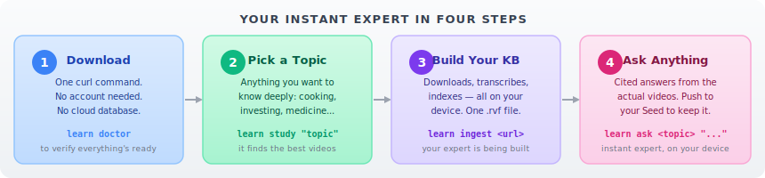
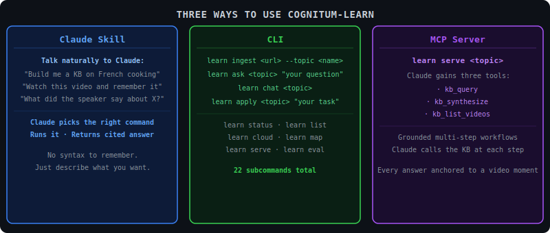
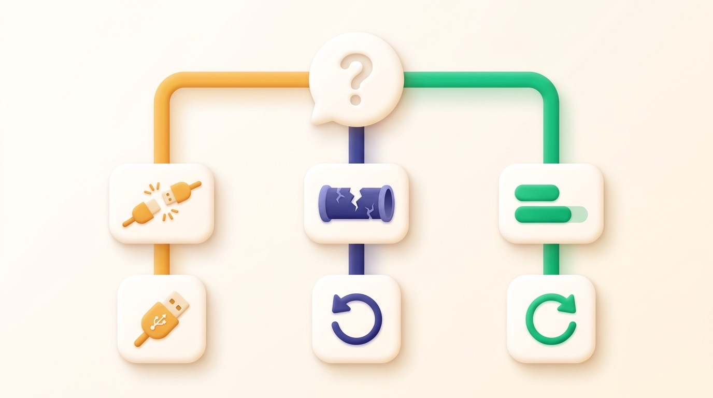
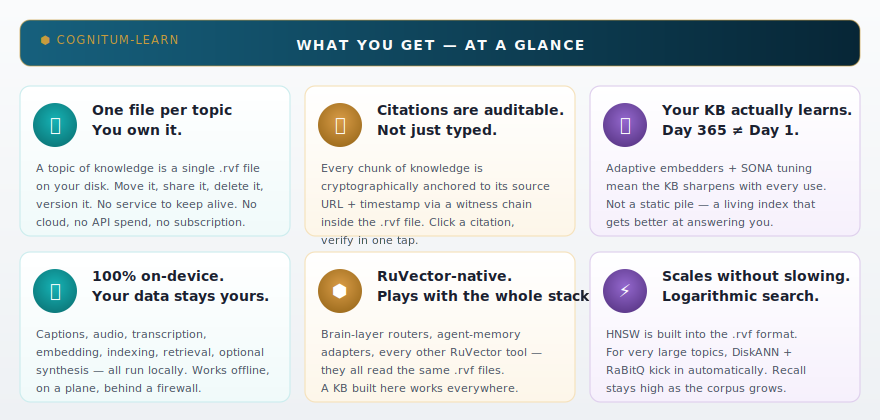
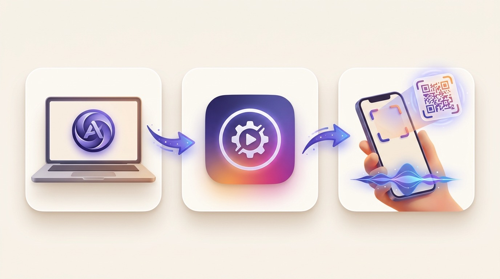
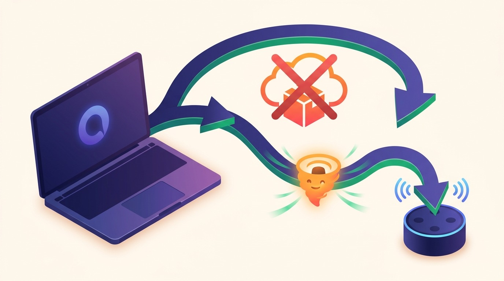
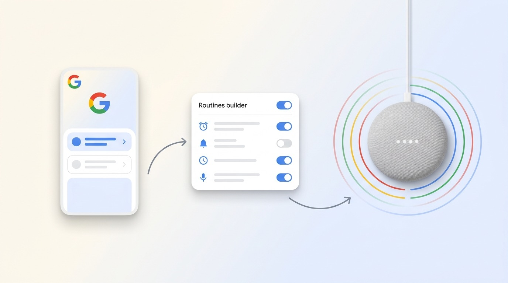
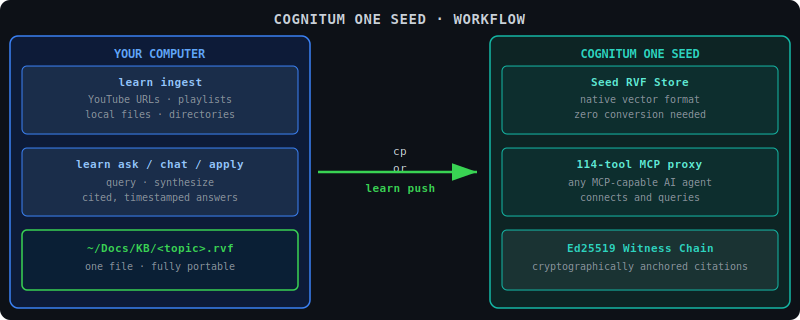
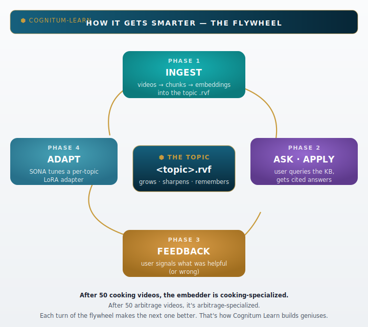

# Cognitum Learn

> **Repo:** [github.com/stuinfla/cognitum-learn](https://github.com/stuinfla/cognitum-learn) · **CLI binary:** `learn` · **Issues:** [report a bug](https://github.com/stuinfla/cognitum-learn/issues)
>
> This repository *is* the `learn` command — the CLI, the `learn ui` dashboard, and the
> `cognitum-learn` Claude Code skill all build from this tree. If you are looking at a
> checkout and wondering whether it is this project: run `learn --version` and compare it
> against [the latest release](https://github.com/stuinfla/cognitum-learn/releases).


**You pick a subject. Cognitum watches the videos and reads the documents for you, then answers your questions — by text on your Mac or out loud through Siri, Alexa, or Google. Everything stays on devices you own.**

*(You don't need the Cognitum Seed hardware to try it — your Mac can do everything by itself. The Seed just lets the answers follow you around your home.)*


<details>
<summary>ASCII version (for AI/accessibility)</summary>

```
              ┌─────────────────────┐
              │  YOU — your topic   │
              │ "sous vide cooking" │
              └──────────┬──────────┘
                         │
   ┌─────────────────────┼─────────────────────┐
   │                     │                     │
   ▼                     ▼                     ▼
 BUILD                 CHAT                  VOICE
(your Mac)         (Mac CLI + UI)       (anywhere at home)

learn study       learn ask              "Hey Siri,
learn ingest      learn chat              Cognitum…"
learn import      learn ui               "Alexa, ask
                                          Cognitum…"
   │                     │                     │
   └─────────────────────┼─────────────────────┘
                         ▼
              ┌──────────────────────┐
              │ COGNITUM ONE SEED    │
              │ ~/Docs/KB/*.rvf      │  ← also on Mac
              │ /var/lib/cognitum/   │  ← on Seed
              │                      │
              │ One file per topic.  │
              │ You own both copies. │
              └──────────────────────┘
```

</details>

This is not just a knowledge-base tool. It is three things that work together:

- **Build** — your Mac downloads videos, transcribes audio, and pushes a searchable expert to your Seed.
- **Chat** — talk to your knowledge base from your computer, via the command line or a local web dashboard.
- **Voice** — ask Siri, Alexa, or Google a question and hear the answer spoken back. Anywhere in your home.

No cloud account. No subscription. Your knowledge lives on your Seed, on your network.

---

## Quickstart — five steps from zero to "Hey Siri, Cognitum"

> **Before you start — you need a free Anthropic API key.** `learn ask` and
> `learn chat` turn your knowledge base into a written answer using Claude, so
> they need a key. Get one in two minutes at **https://console.anthropic.com/**
> (sign up → *API Keys* → *Create Key*), then add it to your shell profile so
> it's always set:
>
> ```bash
> echo 'export ANTHROPIC_API_KEY=sk-ant-...' >> ~/.zshrc   # or ~/.bashrc
> source ~/.zshrc
> ```
>
> Building and quizzing a KB (`learn study`, `learn ingest`, `learn quiz`) works
> without a key — you only need it the moment you ask for a written answer.

```bash
# 1. Install on your Mac (prebuilt binary, no developer tools required)
T=$(mktemp -d) && curl -L https://github.com/stuinfla/cognitum-learn/releases/latest/download/learn-aarch64-apple-darwin.tar.gz | tar xz -C "$T" && "$T/learn-aarch64-apple-darwin/install.sh"
brew install yt-dlp ffmpeg

# 2. Bind your Seed (one time — SKIP if you don't have a Seed yet)
#    No Seed? Cognitum Learn still builds, chats, and quizzes locally on your Mac.
#    You only need a Seed for voice from around the house and cross-device sharing.
# `cognitum-XXXX.local` is the mDNS name printed on the bottom of your Seed; replace XXXX with your unit's four-char ID.
learn config set seed.address cognitum-XXXX.local
learn config set seed.auto_push true
learn doctor

# 3. Build a knowledge base
learn study "sous vide cooking for beginners"

# 4. Chat with it from your Mac
learn chat sous-vide
# OR open the web dashboard
learn ui

# 5. Set up voice — follow docs/voice-setup-manual.md (Apple/Alexa/Google CLI, ~30 min one-time)
#    Apple Siri works today. Alexa is in flight in v0.5.8. A one-command browser wizard ships in v0.6.0.
```



<details>
<summary>ASCII version (for AI/accessibility)</summary>

```
  1. INSTALL          2. BIND SEED        3. BUILD KB        4. CHAT             5. VOICE
  ───────────         ────────────        ──────────         ──────              ──────
  curl … | tar xz     learn config set    learn study        learn chat          learn voice
  install.sh          seed.address …      "sous vide"        sous-vide           setup
  brew install …      learn doctor                           ─or─                ↓
                                                             learn ui            Hey Siri,
                                                                                 Cognitum…
  one-time Mac        one-time per        per-topic          everyday use        once per
  install             Seed pairing        ingest                                 ecosystem
```

</details>

After step 5, *"Hey Siri, Cognitum what temperature for medium-rare steak"* speaks the answer back to you from any iPhone, HomePod, or CarPlay device. (For Echo, the wording is "Alexa, ask Cognitum"; for Google, ask via a Cognitum Routine.)

> Your knowledge base lives at `~/Docs/KB/sous-vide.*` (the searchable vector index is `sous-vide.rvf`; text, audit trail, and raw source cache live alongside it — see [Where your data lives](#where-your-data-lives)). The Seed gets an identical copy at `/var/lib/cognitum/rvf-store/`. You own both.
>
> **Don't have Apple Silicon?** Linux x86_64, Linux aarch64, and Windows x86_64 binaries are on the [latest release page](https://github.com/stuinfla/cognitum-learn/releases/latest).

---

## What you'll see when it works

The first time you run `learn study "sous vide cooking for beginners"`, the terminal walks you through every stage so you can see the KB taking shape:

```text
$ learn study "sous vide cooking for beginners"
[1/8] discovering candidate videos ......................... 12 found
[2/8] you picked 4; downloading captions + audio ........... 4/4
[3/8] smart frame decision (pHash variance) ................ 2 visual, 2 talking-head
[4/8] transcribing (Whisper.cpp, on-device) ................ 18m23s of audio
[5/8] chunking (~300 tokens, 50-token overlap) ............. 412 chunks
[6/8] embedding with BGE-small-en-v1.5 (384-dim, on-device)  412 vectors
[7/8] indexing into HNSW + Ed25519 witness chain ........... ok
[8/8] auto-summary (3-5 takeaways via Claude) .............. ok
wrote ~/Docs/KB/sous-vide.rvf  (4.7 MB)
auto-push → cognitum-9842.local … ok (verified by checksum)

✓ Done. Try one of these next:
   learn ask  sous-vide "what temperature for medium-rare steak?"
   learn chat sous-vide
   learn ui
```

If a step shows red, `learn doctor` will tell you exactly which dependency is missing (yt-dlp, ffmpeg, model cache, Seed reachability) and how to fix it.

---

## Three modes of use

Mac builds. Seed hosts. Voice anywhere.



<details>
<summary>ASCII version (for AI/accessibility)</summary>

```
   MAC (the workshop)              COGNITUM SEED (the house)           YOUR HOME (the voice)
   ─────────────────────           ───────────────────────────         ────────────────────────
   learn ingest <url>      ──►     /var/lib/cognitum/rvf-store/    ◄── "Hey Siri, Cognitum…"
   learn study "topic"             single file per topic               "Alexa, ask Cognitum…"
   learn chat <topic>              answers questions locally           "Hey Google, run Cognitum check"
   learn ui (dashboard)            with cited timestamps
```

</details>

### 1. Build (on your Mac)

The Mac does the heavy work — once per topic. It finds videos, downloads them, runs them through Whisper or VTT captions, breaks the transcript into bite-sized passages, turns each into a 384-number search fingerprint using a tiny open-source model (BGE-small) that runs on your Mac, and writes everything into a single `.rvf` file. If `seed.auto_push: true`, the file is pushed to your Seed automatically when the ingest completes.

```bash
learn study "Japanese knife sharpening"           # autonomous discovery + ingest
learn ingest "https://youtu.be/QZMljuD10sU"        # one video
learn import ~/Downloads/lectures/                 # local files (PDF, MP3, MP4, TXT, MD)
```

### 2. Chat (on your Mac)

Once a KB is built, you can talk to it from your computer two ways: CLI or browser.



```bash
learn ask   knife-sharpening "what angle for a 210mm gyuto?"
learn apply knife-sharpening "give me a 20-minute sharpening routine for 3 knives"
learn chat  knife-sharpening                       # multi-turn dialog, session-persistent
learn ui                                           # opens http://127.0.0.1:7878 in your browser
```

> **Leaving a chat session:** type `/quit` (or `/exit`), or press **Ctrl-D**.
> `/help` lists the in-chat slash commands (`/cite`, `/save`, `/quit`).

`learn ui` is the friendliest entry — a self-contained React dashboard served by the built-in Axum bridge. Pick a topic, watch ingest progress live, chat with the KB, no terminal required.

### 3. Voice (anywhere in your home)

This is the new piece in v0.5.7+. After running the voice setup, you can ask your KB questions out loud and hear the cited answer spoken back. Three ecosystems, same KB:

| Ecosystem | What you say | What you hear back |
|---|---|---|
| **Apple** (iPhone, HomePod, CarPlay) | *"Hey Siri, Cognitum what temperature for medium-rare steak"* | *"54 degrees Celsius for 1 to 4 hours gives perfect medium-rare edge to edge."* |
| **Alexa** (Echo Dot, Echo Show) | *"Alexa, ask Cognitum about laminating dough"* | *"Lamination creates layers of fat between dough sheets, producing flaky pastry."* |
| **Google** (Nest Mini, Nest Hub) | *"Hey Google, run Cognitum check"* | A pre-defined voice Routine fires; speaker broadcasts the answer summary. Arbitrary slot Q&A on Nest hardware is not possible — Google retired that surface in 2023. See [voice setup](#voice-setup) for the three Routine patterns. |

The voice surface is the same KB you built on your Mac. No second copy, no re-indexing.

---

## How is this different from ChatGPT / NotebookLM / Perplexity?

| | What it knows | Where it runs | Voice anywhere in your home |
|---|---|---|---|
| **ChatGPT** | Whatever OpenAI trained it on, plus what you type into the box. Doesn't know *your* videos. | OpenAI cloud. Conversations may train future models. | No (only the phone app). |
| **NotebookLM** | Documents you upload — but Google reads them. | Google cloud. | No. |
| **Perplexity** | Web search results with citations. | Their cloud, every query. | No. |
| **Cognitum Learn** | Only what you fed it. Cited to the second of the source video. | Your Mac (build) and your Cognitum Seed (host). Optional cloud call to Anthropic for the synthesis sentence, replaceable with on-device RuVLLM. | **Yes** — Siri, Alexa, and (with limits) Google. |

Cognitum Learn isn't trying to be smarter than the cloud assistants on general knowledge. It's trying to be the *right* assistant for *your* knowledge — the things you watched, the documents your grandmother typed up, the lectures from your specific course — and to make that assistant reachable from the kitchen, the car, and the bedside table without uploading any of it.

---

## What can you ask?

Whatever you trained the KB on. A few real examples from Stuart's home:

**At the CLI:**

```bash
learn ask sous-vide "what temperature for a medium-rare steak?"
# → 54°C for 1–4 hours [Sous Vide Everything @ 3:12]

learn ask family-recipes "how long does Nonna's tomato sauce simmer?"
# → 3 hours covered, then 1 hour uncovered [grandma-cookbook.pdf p.14]

learn ask type-2-diabetes "is intermittent fasting safe with metformin?"
# → Generally yes if monitored; consult MD. [Dr. Berg @ 12:04, Mayo Clinic @ 4:33]
```

**In the dashboard chat (no terminal):**

> *"Walk me through a croissant lamination schedule for tomorrow morning. My kitchen is 68°F."*
>
> The dashboard hands the question to the KB, picks the best 10 chunks, and gives you a grounded answer with every step linked to the exact video moment that taught it.

**Out loud, anywhere in your home:**

> *"Hey Siri, Cognitum what knife angle for a gyuto."*
>
> *"Alexa, ask Cognitum about beurrage temperature."*
>
> *"Hey Google, is the room safe?"* (Google Routine — uses presence sensors + KB context.)

---

## Voice setup

**Manual setup (v0.5.7 / v0.5.8 — current):** voice access today is a CLI procedure. The full step-by-step is in [`docs/voice-setup-manual.md`](docs/voice-setup-manual.md) — Apple Shortcut install, Alexa Custom Skill publish, Google Routines, plus a `voice-proxy` LaunchAgent on your Mac. About 30 minutes if you've done it once, longer first time.

**Wizard (v0.6.0 — designed, implementation in Phase 2.0):** a single command will replace the 30+ manual steps with an interactive browser wizard.

```bash
learn voice setup                # opens http://127.0.0.1:7878/voice-setup
learn voice setup --ecosystem apple    # one ecosystem at a time
```

The wizard does the work *and* shows you what's happening — embedded OAuth callbacks (no paste-this-code-back-into-the-terminal), live progress over SSE, dynamic QR codes for iPhone hand-off, and pre-recorded GIFs for the Alexa app and Google Home app screens. Architecture is in `ADR-CL-004` (design doc lives in the private cognitum-home-integration repo); the seven UI assets already exist in `assets/voice-setup/`. Implementation lands across cognitum-learn v0.6.0a → v0.6.0d.

### Capability matrix at a glance



<details>
<summary>ASCII version (for AI/accessibility)</summary>

```
                    APPLE              ALEXA                GOOGLE (Nest)
                    ─────              ─────                ─────────────
Free-form Q&A       ✓ Siri Shortcut    ✓ Custom Skill       ✗ ecosystem-limited
Setup time          ≤4 min             ≤5 min               ≤6 min (Routines only)
Cloud cost          $0                 AWS free tier        $0
Privacy footprint   tunnel only        tunnel + Lambda      tunnel + HA notify
Hardware reach      iPhone/HomePod/    Echo Dot/Show/       Nest Mini/Hub +
                    CarPlay/Watch      Auto                 HA-fanned speakers
GA status (today)   v0.5.7 ✓           v0.5.8 in flight     pre-defined Routines
```

</details>

### The three ecosystems at a glance



**Apple** (≤4 min). A Shortcut on your iPhone calls your Mac's voice-proxy over HTTPS via a cloudflared tunnel; the proxy calls `learn ask` and returns the cited answer for Siri to speak. Works on iPhone, HomePod, CarPlay, Apple Watch. Free, LAN-friendly, no developer account needed. **GA in v0.5.7.**



**Alexa** (≤5 min). A private Custom Skill on your Amazon developer account proxies *"Alexa, ask Cognitum about X"* to a Lambda function, which calls your Mac's voice-proxy via the same tunnel. Free under AWS free tier (1M requests/month). **In flight tonight** — the Haiku-fast-path Lambda handler is being isolated in a separate codepath so the slow-path full-Sonnet retrieval doesn't time out Alexa's 8-second response window.



**Google** (≤6 min, optional). Three pre-defined Routines in the Google Home app: *"Hey Google, run Cognitum check"*, *"is the room safe"*, *"good morning Cognitum"*. Each fires a script in Home Assistant that broadcasts a TTS answer back through `notify.google_assistant_sdk`. Sensor fanout (presence, room state) works first-class; **arbitrary-slot Q&A on Nest hardware is not possible** — Google sunset Conversational Actions on June 13, 2023 with no replacement. Use Siri or Alexa for free-form questions.

### What the wizard automates (v0.6.0)


| Phase 1.1 manual step | v0.6.0 wizard behaviour |
|---|---|
| Confirm Seed reachable via `lsof` + mDNS probe | Pre-flight handler hits `GET /api/v1/identity`; UI shows green check |
| `ask configure` (Alexa CLI auth) | Embedded OAuth via cloudflared callback — token captured automatically |
| Mint a Seed bearer via USB pair window | Probed first; if cached bearer valid, step skipped silently |
| Edit Shortcut `.wflow` template by hand | Rendered server-side with your voice-proxy URL pre-filled, served via iCloud QR |
| `cloudflared tunnel run` in a separate terminal | Orchestrator spawns + supervises tunnel for the wizard's lifetime |
| Pick a KB to expose | Wizard enumerates `~/Docs/KB/*.rvf`, checkboxes, push runs with SSE progress |

---

## Privacy and ownership

- **Your knowledge lives on your hardware.** Every file is on your Mac under `~/Docs/KB/` and mirrored to your Seed at `/var/lib/cognitum/rvf-store/`. Copy the directory, back it up, delete it — you control it. See [Where your data lives](#where-your-data-lives) for exactly what's in there.
- **Your audio never leaves your machine.** Whisper and BGE run on-device. The only outbound network call is `learn ask`'s text completion to Anthropic. (An experimental fully-on-device path exists behind the `local-synth` build feature — see `LEARN_SYNTH_LOCAL` in Configuration; it is **not** included in default or prebuilt binaries.)
- **The voice path stays on your LAN.** Siri, Alexa, and Google all hit your Mac's voice-proxy through a cloudflared tunnel — your KB is never uploaded to Apple, Amazon, or Google. The tunnel only carries one HTTPS round-trip per spoken question.
- **No telemetry.** Cognitum Learn does not phone home. Ever.

### Where your data lives

Each topic is **several files**, not one — `learn forget <topic>` is the supported way to remove all of them together; deleting only the `.rvf` leaves the rest behind.

| File | Contents | Required to search? |
|---|---|---|
| `<topic>.rvf` | The HNSW vector index (real [RVF](https://github.com/ruvnet/RuVector) container, via `rvf-runtime`) | Yes |
| `<topic>.meta.json` | Chunk text, video/timestamp metadata | Yes |
| `<topic>.emb.bin` | Embedding cache (rebuildable from `.rvf`) | No — perf cache |
| `<topic>.witness.json` | Append-only audit trail of what was ingested, when | No — audit only |
| `<topic>.summary.md` | Human-readable topic summary | No |
| `_raw/<topic>/` | Downloaded video/caption cache | No — re-fetchable |
| `_meta/<topic>.json` | Ingestion manifest (resume state) | No |
| `_graph/<topic>.graphdb` | Knowledge-graph relations, if built | No |

---

## How it works

### The Mac–Seed–voice split

Cognitum Learn is a three-tier system. Each tier has one job.



<details>
<summary>ASCII version (for AI/accessibility)</summary>

```
  YOUR MAC (the workshop)              YOUR SEED (the house)               YOUR HOME (the voice)
  ─────────────────────────            ─────────────────────────           ───────────────────────────
  Find videos, download them,          Hold the KB. Answer questions       Siri / Alexa / Google sends
  transcribe audio, chunk text,        with the same retrieval +           the spoken question to your
  embed with BGE-small (384-dim),      synthesis pipeline. Native          Mac's voice-proxy via a
  build .rvf, push to Seed.            RVF; no conversion needed.          cloudflared tunnel. The proxy
                                                                            calls `learn ask`, returns text,
                                                                            the assistant speaks it.

  Hardware: M-series Mac               Hardware: Pi Zero 2W                Hardware: iPhone / Echo / Nest
  Software: learn CLI + Whisper        Software: cognitum-agent +          Software: voice-proxy on Mac +
  Storage: ~/Docs/KB/*.rvf             rvf-store + 100+ tool MCP proxy      ecosystem skill / shortcut
```

</details>

**Why this split:** the heavy one-time work (ingest) needs CPU and the internet. The everyday work (answer questions) needs to be on the Seed where the knowledge actually lives. The voice surface needs to be wherever the user is — kitchen, car, bedroom — and so rides through the cloud-borne assistants that already have microphones in those places. Each tier does what its hardware is good at.

The three-ecosystem architecture is documented in `ADR-CL-003` (private cognitum-home-integration repo). Sensor fanout (the 21 RuView entities — presence, temperature, etc.) rides the same path through Home Assistant; voice Q&A is the simpler lane that bypasses HA entirely.

### Ingest pipeline

URL or local file in, searchable expert out. Eight stages, all on your Mac, all on-device except the final auto-summary.


<details>
<summary>ASCII version (for AI/accessibility)</summary>

```
Source URL or path
      ↓
  ACQUIRE — yt-dlp pulls captions first; falls back to audio
      ↓
  SMART FRAME DECISION — pHash variance decides whether to extract
  visual frames (demos) or skip (talking heads)
      ↓
  TRANSCRIBE — VTT captions where available, else Whisper.cpp on-device
      ↓
  CHUNK — sentence-aware, ~300 tokens, 50-token overlap
      ↓
  EMBED — BGE-small-en-v1.5 (384 dimensions, ONNX, on-device)
      ↓
  INDEX — append-only HNSW segments inside the .rvf file,
  with an Ed25519 witness chain per chunk for tamper evidence
      ↓
  AUTO-SUMMARY — Claude generates 3-5 key takeaways
      ↓
  ~/Docs/KB/<topic>.rvf       ←auto-push→     /var/lib/cognitum/rvf-store/<topic>.rvf
```

</details>

### Query path

The same retrieval-and-synthesis pipeline answers a CLI question, a dashboard chat turn, and a Siri request — only the input shape and output shape change.


<details>
<summary>ASCII version (for AI/accessibility)</summary>

```
Question (typed or spoken)
      ↓
  EXPAND — HyDE generates a hypothetical answer as a second query vector
      ↓
  HYBRID RETRIEVE — dense (BGE) + BM25, fused with reciprocal rank fusion → top 50
      ↓
  RERANK — cross-encoder picks the top 10
      ↓
  MMR + SOURCE-CAP — diversity λ=0.7, no more than 3 chunks from any single video
      ↓
  SYNTHESIZE — cited prompt; abstain if signal is weak; AIMDS scan in and out
      ↓
  Cited answer with [Title @ MM:SS](url&t=Xs) links (or spoken summary for voice)
```

</details>

### Storage layout

One file per topic. You can copy, back up, or delete a topic by touching one file. Per-topic isolation is total.


<details>
<summary>ASCII version (for AI/accessibility)</summary>

```
~/Docs/KB/                          ← on your Mac
├── sous-vide.rvf                   ← chunks, embeddings, HNSW, witness chain
├── french-cooking.rvf
├── sous-vide.summary.md            ← auto-generated takeaways
├── _graph/sous-vide.graphdb        ← claims, entities, relations
├── _meta/sous-vide.json            ← per-video state
└── _chat/sous-vide/                ← session JSONL files

/var/lib/cognitum/rvf-store/        ← on your Seed (after push)
└── <topic>.rvf

~/.cognitum-learn/                  ← Mac-side state
├── voice-setup-state.json          ← (v0.6.0) wizard resume state
└── voice-proxy.token               ← (v0.5.7+) bearer for voice surface
```

</details>

### Architecture: 17 crates, one binary


<details>
<summary>ASCII version (for AI/accessibility)</summary>

```
   ┌─────────────────────────────────────────────────────────────────┐
   │                         learn (CLI binary)                      │
   │                            learn-cli                            │
   │                  25 subcommands, voice setup entry (v0.6.0)              │
   └────────┬──────────┬──────────┬──────────┬──────────┬─────────┘
            │          │          │          │          │
            ▼          ▼          ▼          ▼          ▼
       INGESTION   RETRIEVE    SYNTH      CHAT     SERVE/VOICE
       acquire     retrieve    synth      chat     serve
       asr         (BM25+      (cited     (REPL,   (Axum + MCP
       frames       dense,     answers,    JSONL   + v0.6.0
       chunk        rerank,    AIMDS       sessions) wizard)
       embed        MMR)       in/out)              voice-proxy
       index                                        (scaffolding)
       graph
            └──────────┴──────────┴──────────┴──────────┘
                                  │
                                  ▼
                            learn-core
                       (shared types, errors,
                          topic slug logic)
```

</details>

### How knowledge improves over time

Every query teaches the Seed which chunks were useful and which weren't. Over time, the SONA per-topic adapter quietly retrains and your KB gets better at answering your kind of question without you ever leaving the loop.



<details>
<summary>ASCII version (for AI/accessibility)</summary>

```
            ┌──────────────────────┐
            │ 1. You ask a         │
            │    question          │
            └──────────┬───────────┘
                       ▼
            ┌──────────────────────┐
   ┌────────┤ 2. Seed retrieves +  │
   │        │    cites an answer   │
   │        └──────────┬───────────┘
   │                   ▼
   │        ┌──────────────────────┐
   │        │ 3. You read it,      │
   │        │    click a citation, │
   │        │    or ask follow-up  │
   │        └──────────┬───────────┘
   │                   ▼
   │        ┌──────────────────────┐
   │        │ 4. SONA adapter      │
   │        │    learns which      │
   │        │    chunks won        │
   │        └──────────┬───────────┘
   │                   ▼
   │        ┌──────────────────────┐
   └───────►│ 5. Next answer is    │
            │    a little sharper  │
            └──────────────────────┘
```

</details>

---

## Troubleshooting

### Mac and Seed

**"My Seed isn't reachable" / `learn doctor` red on `seed.reachable`.** Confirm the address with `ping cognitum-XXXX.local` or use the raw IP printed on the Seed. Some routers drop `.local` names; fall back to `learn config set seed.address 192.168.x.x`. Mac and Seed must be on the same LAN. The auth token, if your Seed requires one, lives at `~/.config/cognitum/seed.token` and is read automatically.

**"Dimension mismatch" when pushing to the Seed.** Cognitum Learn embeds at 384 dims (BGE-small). A fresh Seed often shows `dimension: 8` because its sensor pipeline wrote first. The Seed is *not* hardware-limited to any particular dimension — fix it by editing the agent's `--dimension` flag and wiping the old store. Full procedure in [`docs/voice-setup-manual.md`](docs/voice-setup-manual.md) under "Dimension fix." Never chase this as a firmware bug.

**"I built a KB with an older version and now `learn ask` returns nothing."** Versions before v0.2.17 used a 1024-dim embedder; new 384-dim query vectors won't match. Re-ingest: `learn ingest <url> --topic <topic>`. `learn compact` does *not* re-embed.

### Voice setup

**iPhone Shortcut returns nothing (most common).** The voice-proxy is bound to `127.0.0.1` instead of `0.0.0.0`, so the cloudflared tunnel can't reach it. Set `COG_VOICE_BIND=0.0.0.0` in `~/Library/LaunchAgents/com.cognitum.voice-proxy.plist`, then `launchctl unload && launchctl load` it. Verify with `lsof -nP -i :7879` — you want `*:7879 (LISTEN)`, not `127.0.0.1:7879`.

**Apple Shortcut won't trigger at all.** Name the Shortcut `Cognitum` (NOT `Ask Cognitum`); avoid Siri-reserved verbs like `Ask`, `Tell`, `Call`, `Text` — Siri routes those to Contacts/Messages instead of your Shortcut. The v0.6.0 wizard detects both automatically and offers a re-install QR.

**Apple Shortcut won't trigger.** The Shortcut needs your voice-proxy URL embedded at install time. If you renamed the proxy or changed the cloudflared tunnel, re-install the Shortcut. The v0.6.0 wizard's troubleshooting screen (above) detects this automatically and offers a re-install QR.

**Alexa skill returns "Cognitum is having trouble."** Almost always a Lambda cold-start or timeout. The v0.5.8 release adds the Haiku-fast-path that returns within Alexa's 8-second window for short queries; long queries still fall back to a "let me think about that for a moment" response. Watch the Lambda logs (`aws logs tail /aws/lambda/ask-cognitum --follow`) for the actual error.

**Google Routine fires but speaker stays silent.** The TTS broadcast hop (`notify.google_assistant_sdk`) needs your `homegraph` service account credentials at `~/.homeassistant/google_service_account.json`. If the file is missing, only the scene fires — there's no spoken response. Re-run the Google branch of the wizard, or drop the JSON manually at `~/.homeassistant/google_service_account.json` (generate from Google Cloud Console → Home Graph API service account).

**cloudflared tunnel URL changes every reboot.** Quick tunnels (free) get a new `*.trycloudflare.com` on each invocation. Amazon won't accept that — its OAuth redirect URI is fixed per skill. Fix: either keep the tunnel up (the v0.6.0 wizard supervises it via launchd), or migrate to a Cloudflare account with a named tunnel (free, requires domain ownership).

### Models and dependencies

**Whisper or BGE didn't download.** Models auto-fetch into `~/.cache/learn-rs/models/`. If that failed, `learn doctor` shows which are missing; delete the cache and re-run to force a refresh.

---

## Honest current state (v0.5.10, 2026-05-28)

This README reflects what is shipped tonight and what is queued. Cognitum Learn is moving fast and we'd rather tell you what's real than make promises.

| Surface | State | Notes |
|---|---|---|
| **Build** (`learn ingest` / `learn study`) | **GA, v0.5.4+** | Apple Silicon binary primary; Linux x86_64 + Linux aarch64 + Windows x86_64 binaries published every tag. |
| **Mac chat** (`learn chat` + `learn ui`) | **GA, v0.2.11+** | React dashboard at `http://127.0.0.1:7878`; 4-step onboarding wizard for new Seed owners. |
| **Apple voice** (`Hey Siri, Cognitum`) | **GA, v0.5.7+** | Voice-proxy LaunchAgent + Shortcut + cloudflared tunnel; verified end-to-end on Stuart's stack. |
| **Alexa voice** (`Alexa, ask Cognitum`) | **In flight tonight** | Haiku-fast-path Lambda being isolated in v0.5.8 to fit Alexa's 8-second window; full GA expected v0.5.9. |
| **Google voice** (Routines only) | **Scripted-only** | Three pre-defined Routines work today; arbitrary-slot Q&A on Nest hardware is *not possible* (ecosystem constraint — Google retired Conversational Actions in 2023). |
| **v0.6.0 wizard** (`learn voice setup`) | **Scoped + designed** | `ADR-CL-004` ratified (private design doc); 7 visual assets generated; implementation lands across Phase 2.0a → 2.0d (5–7 days). Until then, voice setup is manual. |
| **Linux ARM64 + Intel Mac voice setup** | **Mac-only today** | The voice-proxy assumes a Mac LaunchAgent. Pi Zero / Linux desktop hosting is on the roadmap, not shipped. |

---

<details>
<summary><strong>📦 All 25 commands</strong></summary>

### Discovery + ingestion

- **`learn study "<topic>"`** — strategic: describe what you want to learn, Cognitum Learn finds candidates, ingests on confirmation.
- **`learn ingest <url>`** — tactical: paste a URL, playlist, channel, or search query.
- **`learn import <dir>`** — bulk ingest a local folder (PDF, MP4, MP3, TXT, MD).

### Consumption

- **`learn ask`** — cited answer grounded in the KB.
- **`learn apply`** — uses the KB as prior to produce a grounded artifact.
- **`learn chat`** — multi-turn dialog with session persistence.
- **`learn quiz`** — generates practice questions from the KB.

### Inspection + visualization

```bash
learn status   <topic>       # chunk count, file size, coherence KPI
learn list     <topic>       # videos in the topic
learn who-said <topic> "Julia Child"
learn timeline <topic> "beurrage"
learn compare  <topic-a> <topic-b>
learn cloud    <topic>       # SVG word cloud
learn map                    # 2D galaxy of all your topics
learn summarize <topic>      # key takeaways
```

### Distribution + maintenance

```bash
learn push    <topic>        # push KB to your Cognitum One Seed
learn serve   <topic>        # MCP server for Claude Code
learn ui                     # local web dashboard
# learn voice setup is the v0.6.0 wizard — not in this release; see docs/voice-setup-manual.md
learn watch   <topic>        # monitor a YouTube channel
learn eval    <topic>        # regression Q&A
learn forget  <topic> <video-id>
learn compact <topic>        # dedupe + optimize the index
learn doctor                 # health check
```

### Setup + configuration

```bash
learn setup                                  # guided first-run wizard
learn config set seed.address 192.168.x.x
learn config set seed.auto_push true
learn config get seed.address    # or seed.auto_push, seed.token — bare `seed` is not a valid key
```

</details>

<details>
<summary><strong>⚙️ Configuration</strong></summary>

| Variable | Purpose | Default |
|---|---|---|
| `ANTHROPIC_API_KEY` | Required for `learn ask` / `learn apply` / `learn chat` synthesis | unset |
| `LEARN_SYNTH_LOCAL` | `1` → use local RuVLLM instead of Anthropic. **Experimental** — requires building from source with `cargo install --path crates/learn-cli --features local-synth` (CPU inference; Metal has known upstream issues). Default/prebuilt binaries fail fast with guidance. | `0` |
| `LEARN_AIMDS_REQUIRED` | `1` → fail closed on any `Blocked` AIMDS verdict | `0` |
| `LEARN_KB_ROOT` | Where `.rvf` files live | `~/Docs/KB` |
| `LEARN_EMBED_MODEL_DIR` | Where Whisper + BGE models cache | `~/.cache/learn-rs/models` |
| `RUST_LOG` | Tracing filter (`info`, `debug`, `learn_synth=trace`) | `warn` |

**Seed config** is persisted via `learn config set seed.*`. Relevant keys: `seed.address`, `seed.token`, `seed.auto_push`.

### On-device synthesis (`LEARN_SYNTH_LOCAL=1`)

The fully-local answer path is experimental and has two requirements that are easy to miss:

**A sidecar `tokenizer.json` is required, next to the model file.** The candle backend does
not read the tokenizer embedded inside the GGUF — it looks for a separate `tokenizer.json`
in the same directory:

```
~/.cache/learn-rs/models/
├── ruvllm-default.gguf
└── tokenizer.json          ← download this from the model's HuggingFace repo
```

Without it, `learn` warns at model load and generation fails with `No tokenizer loaded`.
(Reading the GGUF-embedded tokenizer is an upstream change in
[ruvnet/RuVector](https://github.com/ruvnet/RuVector).)

**Context is capped at 4096 tokens, and excerpts are trimmed to fit.** Prompt and answer
share a fixed 4096-position budget — that limit is structural (candle's quantized-llama
allocates a fixed-size RoPE cache), not a setting you can raise. `learn` measures the
assembled prompt and drops the lowest-ranked excerpts until it fits, reserving room for the
answer. When that happens you'll see a `trimmed source excerpts` warning under `RUST_LOG=warn`,
and **only the excerpts that survived the trim are cited** — an answer never cites a source
the model didn't actually read. A large `--depth` on a big KB will therefore trim more; the
Anthropic path (unset `LEARN_SYNTH_LOCAL`) has no such ceiling.

</details>

<details>
<summary><strong>🖥️ Platform support</strong></summary>

| Platform | Prebuilt binary? | Voice setup? | Notes |
|---|---|---|---|
| M-series Mac | yes | yes (Mac is the canonical voice-proxy host) | Primary platform |
| Linux x86_64 | yes | manual only | Captions-only ingest (no on-device Whisper on Linux) |
| Linux aarch64 (Pi 5, Jetson) | yes | manual only | Captions-only |
| Windows x86_64 | yes | manual only | No on-device speech recognition |
| Intel Mac | build from source | manual only | macOS-13 GitHub runner deprecated |

</details>

<details>
<summary><strong>🧪 Testing</strong></summary>

```bash
cargo fmt --check
cargo clippy --workspace --all-targets -- -D warnings
cargo test --workspace
cargo build --release --workspace
```

CI requires all four green before merge. 380+ unit + integration tests as of v0.5.10; the suite grows with each release.

</details>

---

## License + contributing

Licensed under the [PolyForm Noncommercial License 1.0.0](LICENSE). Free for personal, research, and other noncommercial use. For a commercial license, contact the author.

This license is intentional. Cognitum Learn is built for the people who own a Cognitum Seed and want it to be smart about something that matters to them. It is not built for someone to wrap and resell as a hosted service. If your use is personal, educational, or research, you're in the right place.

Contributions welcome. Open an issue before sending a PR larger than ~50 lines so we can align on approach. CI gate must be green.

---

*Built with [RuVector](https://github.com/ruvnet/ruvector) · PolyForm Noncommercial 1.0.0 · [Releases](https://github.com/stuinfla/cognitum-learn/releases)*
